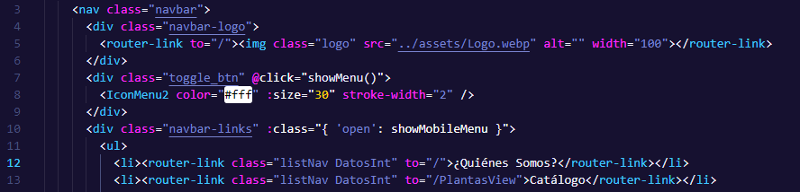

# 1-Suculentas
Este es el archivo README del portafolio del proyecto Suculentas para optar a la insignia de Talento Digital.

## Introducción
Suculentas Online es una página web dedicada a la compra y venta de suculentas. Proporciona un catálogo en línea donde los usuarios pueden explorar una variedad de suculentas disponibles para la compra. El proyecto se ha desarrollado utilizando el framework Vue, junto con tecnologías como Vue Router, Vuex, Bootstrap y Firebase.

## Requerimientos del usuario
Los usuarios desean explorar y comprar suculentas de manera fácil y conveniente.
El administrador del sitio desea tener acceso a una interfaz de administración para gestionar el catálogo de suculentas.

## Requerimientos del sistema
El sistema debe proporcionar un catálogo de suculentas que muestre información detallada sobre cada producto.
Debe haber una interfaz de administración protegida para que el administrador pueda agregar, editar y eliminar suculentas del catálogo.
La autenticación de usuarios debe ser segura y solo permitir el acceso del administrador a la interfaz de administración.
El sistema debe integrar una API externa para mostrar información adicional sobre otras plantas.
Se requiere un carrito de compras funcional que permita a los usuarios agregar productos y recibir un correo con el detalle de su compra.
La navegación en el sitio debe ser intuitiva y adaptable a diferentes dispositivos y tamaños de pantalla.
Se desea que los usuarios puedan contactar al vendedor a través de WhatsApp para consultas adicionales.

## 1-Experiencia de uso 
La aplicación ofrece a los usuarios una experiencia de compra atractiva y sencilla. Pueden explorar el catálogo de suculentas, ver información detallada sobre cada producto y agregarlos al carrito de compras. El diseño responsivo del sitio garantiza una experiencia óptima en diferentes dispositivos. Además, el administrador tiene acceso a una interfaz de administración protegida donde puede gestionar el catálogo de suculentas de manera fácil y eficiente. 

## 2-Completitud del entregable
El entregable final de Suculentas cumple con todas las funcionalidades descritas en los requerimientos del sistema. Estos son los módulos principales que se han desarrollado: HomePage/Catalogo online/Login-logout/Mantenedor/Carrito de compras. Adicional a esto se ha implementado la funcionalidad de enviar un correo electrónico al usuario con los detalles de su compra. 

## 3-Utilización de tags html
En todos los componentes, se ha seguido el estándar HTML5 utilizando etiquetas semánticas apropiadas, como header/nav/div/h1/ul/li etc.
  
[src/components/NavBar.vue](src/components/NavBar.vue)-- Linea 1 --

## 4-Responsividad
El proyecto es completamente responsivo, adaptándose a diferentes tamaños de pantalla. Se han utilizado media queries y la responsividad de bootstrap para garantizar  una visualización y diseño adecuado para diferentes dispositivos.
  
[src/components/NavBar.vue](src/components/NavBar.vue)-- Linea 1 --

## 5-Utilización de un framework de css
Se ha utilizado Bootstrap en la gran mayoría del proyecto, aprovechando sus componentes y estilos predefinidos. Esto ha permitido agilizar el desarrollo y mantener una apariencia visual coherente en todo el proyecto, asegurando una interfaz atractiva y fácil de navegar para los usuarios.
  
[src/views/PlantasView.vue](src/views/PlantasView.vue)-- Linea 1 --

## 6-Código mantenible mediante componentes
El proyecto se ha desarrollado utilizando una estructura basada en componentes en Vue CLI, lo que ha permitido mantener un código mantenible y organizado. Además, al ser una aplicación de una sola página (SPA), los usuarios disfrutan de una experiencia de usuario fluida al navegar por las distintas secciones del proyecto.
  
[src/views/PlantasView.vue](src/views/PlantasView.vue)-- Linea 1 --

## 7-Utilización de los métodos del ciclo de vida de un componente
Se ha utilizado el ciclo de vida mounted en varios componentes del proyecto.
  
[src/views/LoginView.vue](src/views/LoginView.vue)-- Linea 1 --

## 9-Utilizacion de buenas practicas en la definicion de rutas
Nombres descriptivos para las rutas  
 
[src/router/index.js](src/router/index.js) --linea 17/n-- 
Parametro por URL  
 
[src/router/index.js](src/router/index.js) --linea 79-- 

## 10- Utilizacion de sintaxis basica JavaScript
Utilizacion de declaración de variables y métodos de formateo en javascript
 
[src/components/SucculentsApi.vue](src/components/SucculentsApi.vue) --linea 115/126-- 

## 11- Utilizacion de Javascript es6/7 para resolver un problema
Se utiliza es6 en el proyecto en la gran mayoría de los componentes  
  
[src/views/PlantasView.vue](src/views/PlantasView.vue)-- Linea 1 --

## 12- Consumo API
Se utiliza el consumo de una API que proporciona información sobre otras plantas
 
[src/components/SucculentsApi.vue](src/components/SucculentsApi.vue) --linea 115/126-- 

## 13-Estados internos de los componentes web
Utilizacion de estado de objeto data dentro del componente(error)
  
[src/views/LoginView.vue](src/views/LoginView.vue)-- Linea 1 --

## 14- Maneja el estado de la aplicación con Vuex
Manejo de estados del CRUD por medio de estructura de Vuex action
 
[src/router/index.js](src/router/index.js) --linea 79-- 